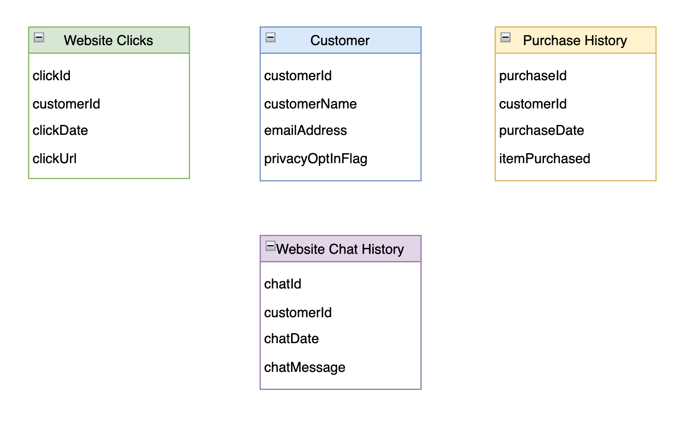

# Joining Multiple Data Sources

As with most SQL databases, if you have two or more glue tables that share a common field (foreign key), you can join the two tables on the common field. The result is a composite of the fields from both records. 

In the above example, joining the **customer** record with another table will create a composite of the fields from both tables. This allows us to determine if the given record is subject to privacy restrictions.

An **inner join** omits rows where there isn't a match between both tables.  An inner join is the default type when joining two tables with SQL. This serves our use case perfectly.

# Join Accelerometer with Customer Data

*Hint: as with most SQL Databases, glue tables don't require strictly defined foreign keys*

As with any SQL select statement, we have to first choose the primary table in our select statement. In our case it will be the **customer** table.

We need to identify which columns should be used for the join. As you can see, there are no fields with matching names. However, there are two fields with matching data.

**Use the Athena Query Editor to write a query joining both tables, and identify the fields with shareWithResearchAsOfDate not null.**