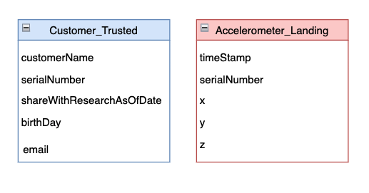

# Data Privacy in Data Lakes

Data lakes are a hazard for privacy enforcement. Data from many sources containing Personally Identifiable Information are brought in from a variety of sources. These sources often have wide open access, without enforcing proper privacy constraints. This means the data in the landing zone should be dealt with very carefully. 

 

Data in the **landing zone** should not be made available for data analysis without proper scrubbing. One way to filter data is based on opt in flags on the customer record. If we are dealing with the customer record directly, and this is where that field is located, we are in good shape. Often the data we are dealing with are secondary to the customer record, such as website analytics, transaction history, or other events.

# Joining Multiple Data Sources

As with most SQL databases, if you have two or more glue tables that share a common field (foreign key), you can join the two tables on the common field. The result is a composite of the fields from both records. 

In the above example, joining the **customer** record with another table will create a composite of the fields from both tables. This allows us to determine if the given record is subject to privacy restrictions.

An **inner join** omits rows where there isn't a match between both tables.  An inner join is the default type when joining two tables with SQL. This serves our use case perfectly.

# Join Accelerometer with Customer Data

Using glue you can do joins between multiple data sources.  You can then add filters to include only those records where customers have opted to share their information. Let's practice using some Accelerometer data.

*Hint: as with most SQL Databases, glue tables don't require strictly defined foreign keys*

As with any SQL select statement, we have to first choose the primary table in our select statement. In our case it will be the **customer_trusted** table.

We need to identify which columns should be used for the join. As you can see, there are no fields with matching names. However, there are two fields with matching data.

**Use the Athena Query Editor to write a query joining both tables, and identify the fields with shareWithResearchAsOfDate not null.**