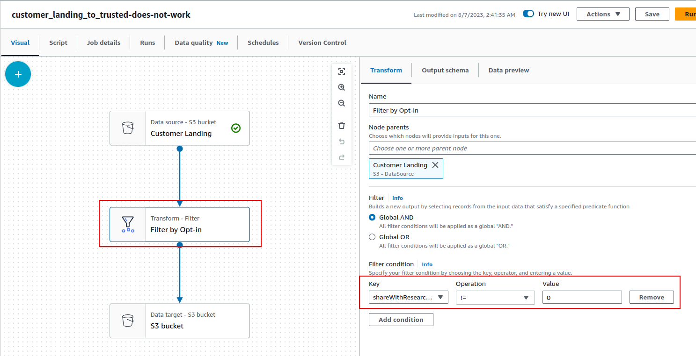
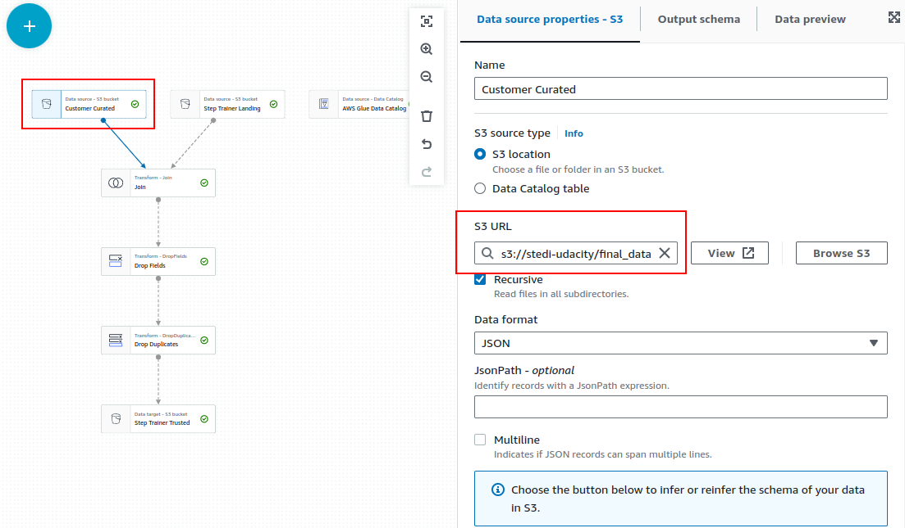
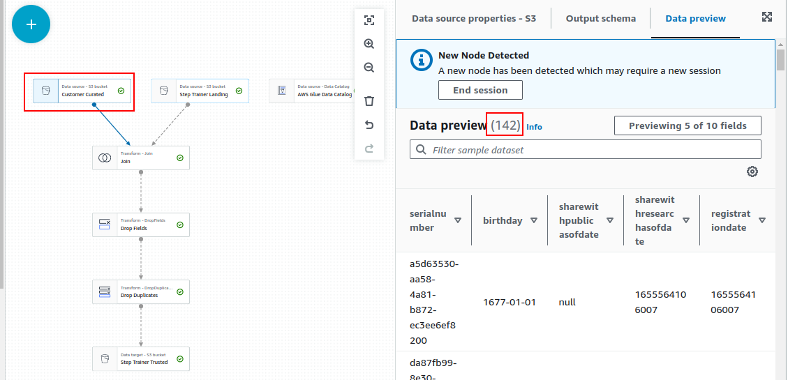
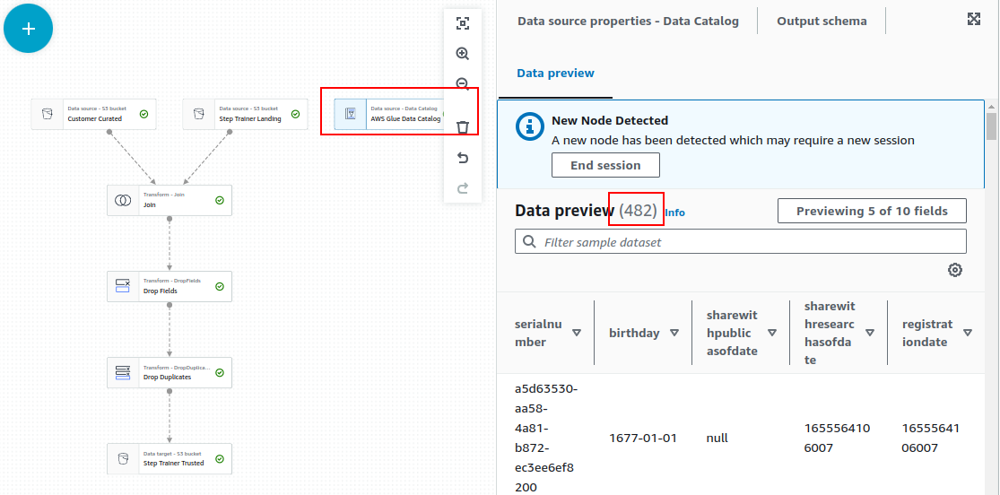
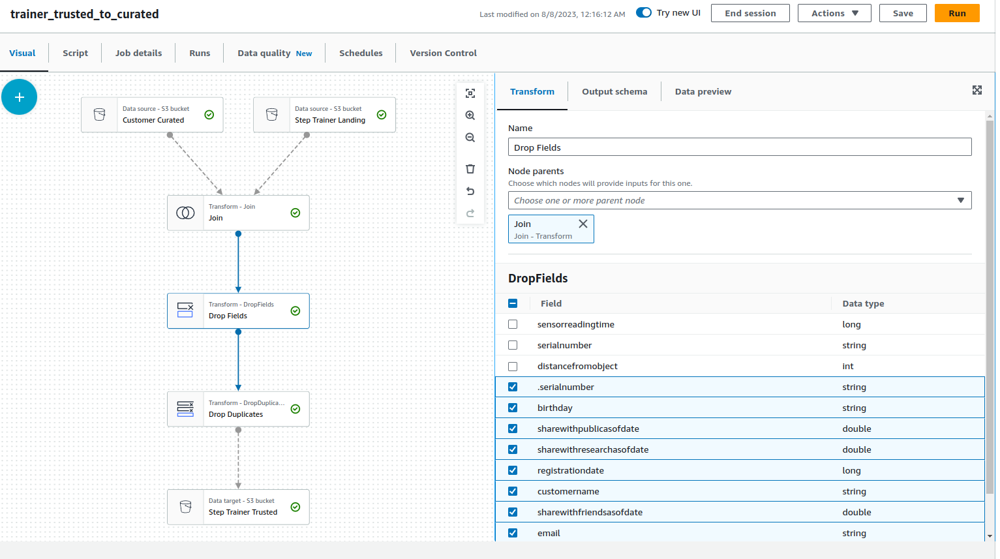
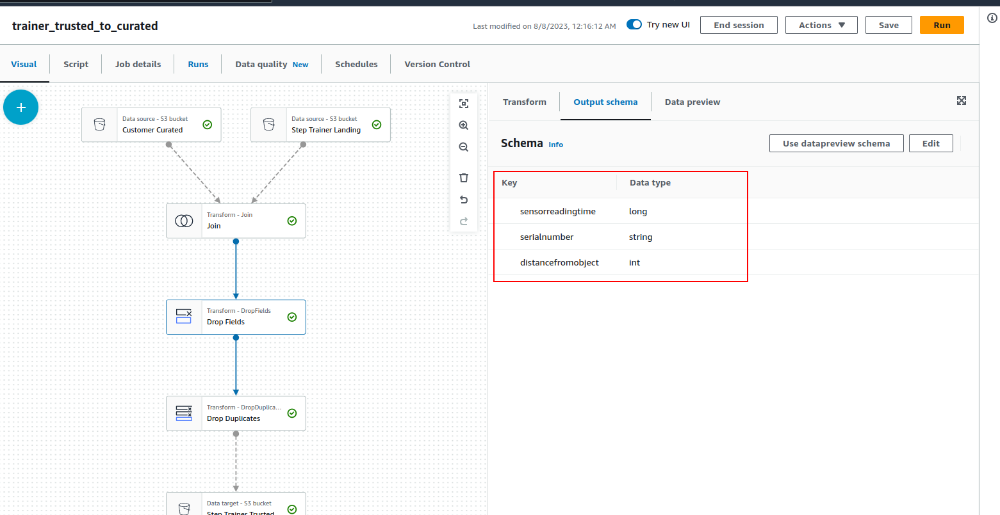
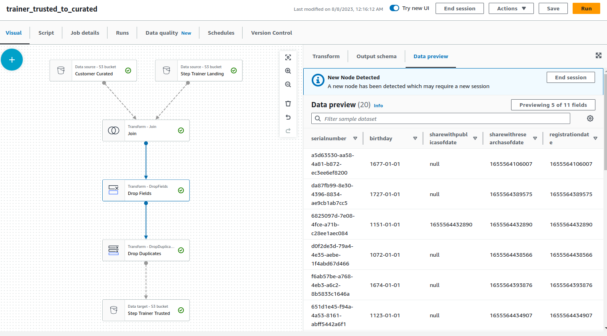
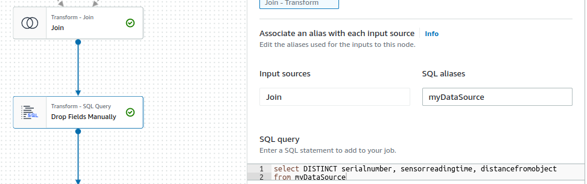

# Starter Data for the STEDI Human Balance Analysis project

# Overview

The following are the complete step-by-step tasks I did to update the data from its previous version:

1. Download customer, accelerometer, and step trainer data from the zip file.
2. Fix the formatting error and incomplete files. We call this the complete & cleaned data.
3. Upload the complete & cleaned data to AWS Glue.
4. Reduce the number of data points but do it smartly. Keep only relevant data.
5. Redo the project with the new data.
6. Record issues met and their solutions.


# Highlights

Original data:

* 999 rows in the customer_landing table
* 744,413 rows in the accelerometer_landing table
* 239,760 rows in the step_trainer_landing table.
* When combined, there were 2+ million rows.
* Processing the accelerometer data alone took 36+ minutes. There's no hope to process the step trainer data. Most students (all?) submitted untested projects.
* There are customers with identical email addresses as mentioned in [this Knowledge question](https://knowledge.udacity.com/questions/999505).

Complete & Cleaned data:

* 758715 rows in the customer landing table
* Incomplete files:
    * customers/customers-1655295864820.json
    * customers/customers-1655296388814.json
    * customers/customers-1655293823654.json
    * customers/customers-1655293823654.json
    * accelerometer/accelerometer-1655471583651.json
    * step_trainer/step_trainer-1655471583651.json

Final/Reduced data:

* 956 customers, each with a unique email.
    * 474 customers with empty sharewithresearchasofdate.
* All of these customers have accelerometer and step trainer data.
    * Join with accelerometer data on emails.
    * Join with step trainer data on serial numbers and timestamps.
* 81,273 accelerometer rows, no duplicates.
* 28,680 step trainer rows, no duplicates.
* 81,273 combined rows.
* The entire data loading took only a bit less than 13 minutes - See the details in the Jobs section below.
* I ran into a myriad of issues when working on this project, due to course content problems. In the Issues and Tips sections below I detailed them and recorded my solutions.

# Queries
## All connected rows and sanitized

```
SELECT COUNT(*)

FROM "customer_cleaned_landing" cl

    JOIN "accelerometer_cleaned_landing" al ON cl.email = al.user

    JOIN "step_trainer_cleaned_landing" sl ON cl.serialnumber = sl.serialnumber AND al.timestamp = sl.sensorreadingtime

WHERE cl.sharewithresearchasofdate IS NOT NULL;
```

- There are currently 2,043,198 rows.
- Run time in Athena: 15.173 sec
- Data scanned 316.20 MB

## How many distinct emails are there?

```
SELECT COUNT(DISTINCT email) FROM "customer_cleaned_landing";
```

There are only 957 distinct emails.


## Are there duplicates in step trainer data (duplicated `sensorreadingtime` and `serialnumber` pairs, that is)?

```
SELECT sensorreadingtime, serialnumber, COUNT(*)
FROM step_trainer_cleaned_landing
GROUP BY sensorreadingtime, serialnumber
HAVING COUNT(*) > 1;
```

## Reduced data rows

* Get unique customers by emails with the earliest registrationDate.
* Get relevant accelerometer and step trainer data of those customers.

```
WITH
    cl_distinct_emails AS (
        SELECT *, row_number() OVER (PARTITION BY email ORDER BY email, registrationDate DESC) AS row_num
        FROM customer_cleaned_landing

    )
SELECT DISTINCT *
FROM cl_distinct_emails cl
    JOIN accelerometer_cleaned_landing al
        ON cl.email = al.user AND cl.row_num = 1
    JOIN step_trainer_cleaned_landing sl
        ON cl.serialnumber = sl.serialnumber
            AND al.timestamp = sl.sensorreadingtime;
```

Results: 81,273 rows

# Jobs

Start-up time is always 6-7s.

## customer_landing_to_trusted\.py

### Old version

Execution time: 54 s

### New version

Execution time: 56 m

Size of customer_trusted: 482 rows

## accelerometer_landing_to_trusted_zone\.py

### Old version

Execution time: 36 m 24 s

### New version

Execution time: 55 s

Size of accelerometer_trusted: 40,981 rows

## customer_trusted_to_curated\.py

### Old version

Execution time: who knows?

### New version

Execution time: 1 m 50 s

Size of customer_curated: 482 rows (means all customers have accelerometer data)

## step_trainer_trusted\.py

### Old version

Execution time: who knows?

### New version

Execution time: 7 m 6 s

Size of step_trainer_trusted: 28,680 rows

## machine_learning_curated\.py

### Old version

Execution time: who knows?

### New version

Execution time: 1 m 57 s

Size of machine_learning_curated: 46,022 rows

# Q&A

## What does this mean? "Create a table in the Data Catalog and on subsequent runs, update the schema and add new partitions"

When ticked, this means you will create a table in the Data Catalog after the run completes. You can run queries on the created table via Athena. Additionally, it will update the schema and add new partitions on subsequent runs, so you may add more columns as needed.

Execution time with **keep existing schema and add new partitions**: 1m 8s

Execution time with **update the schema and add new partitions**: 1m 13s

I suggest activating this option.

# Issues

While testing the new data, I found myriads of issues in either the course or AWS. I bet the students have much more of them, so I'll list them here, so that we may let students be aware of these issues and how to deal with them.


## Classroom video has an incorrect suggestion

Transform - Filter **does not** remove NULL shareWithResearchAsOfDate field




## Re-running a job causes data to be processed again (job bookmark = disable)

**Solution: **Do not forget to delete the S3 folder before re-running a job.

## customer_trusted_to_curated created many duplicates (total 40981 rows)

**Solution: **Add Drop Duplicates node at the end.

## trainer_trusted_to_curated is not an appropriate name (update the one in the rubric)

It should be "trainer_landing_to_trusted" since it uses the trainer landing data to build trainer trusted data. "trainer_trusted_to_curated" is "machine_learning_curated" in the project.

As shown in the Project Instructions page, the name is step_trainer_trusted.

## step_trainer_trusted can't fully read customer_curated data

There should be 482 customer curated data, but when loaded using **Data Source - S3 bucket **in trainer_trusted_to_curated, there's only 142 rows.

Here's the setting in step_trainer_trusted:





It has only 142 rows:




**Solution:** Use **Data Source - Data Catalog** instead.

Here's the setting:


And the number of rows is correct now:



## step_trainer_trusted takes forever to run

* Make sure that the number of rows of customer_curated and accelerometer_trusted tables are correct
* Even when the data are correct, the standard join gives 13823760

**Solution:** Use **Transform - SQL Query** and SELECT DISTINCT in your query.


## step_trainer_trusted does not produce any data during join

Use data preview with larger sample rows. Sometimes getting from glue catalog does not return complete data

## Drop Fields node sometimes do not work

DropFields node has dropped some fields:




And the Output schema reflects this:





Yet these deleted fields still show in the data preview:





**Solution:** Do not use DropDuplicates node. Perhaps this is due to the parallelism in Spark or AWS Glue itself, but for some reason some operations just don't work. Use **Transform - SQL Query** instead:




# Tips

Here are some advice to complete this project - we may need to create content pages for them:


* Use the option **Create a table in the Data Catalog and on subsequent runs, update the schema and add new partitions** so you don't have to manually recreate the tables.
    * Note: Sometimes the output is unpredictable. For instance, when I created the step trainer trusted table, somehow it created lastupdateddate instead of sensorreadingtime field. When that happens, just delete the table (but not the S3 directory) then recreate it manually through Athena.
* Data Preview is your friend. Click on the small gear icon next to the "Filter sample dataset" text box to adjust the number of sample rows (500 to 1000 is good, more than that is perhaps too much). **Before running your query, preview your data.**
* Glue Jobs **don't **delete old data. When you need to re-run a job, delete the directory in the S3 bucket. When changes to the fields are needed, delete the table from Athena as well.
* Always use a **Data Catalog** instead of an **S3 bucket **node. The former is more predictable. With the latter, sometimes it pulls partial data.
* Despite what the course taught, **do not **use Drop Fields, Filter, and (maybe) Drop Duplicates nodes. They are **VERY** unpredictable. Use **SQL Query** nodes instead and **write your own queries**.
